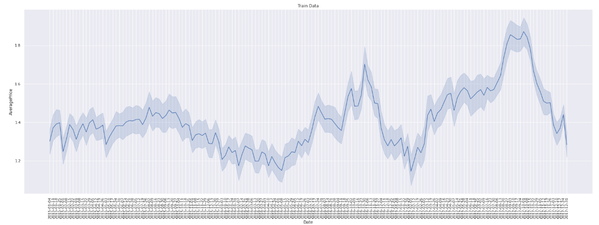

# Price-Forecasting
The objective of this project is to forecast the future price of Avocado. The data presents a time series of the average Avocado price of different regions in the US over 4 years timeline. The data from the years 2015-2017 have been used to forecast the average price of Avocado in 2018. Different exploratory data analysis (EDA) has been performed to gain  insights from the data.

• EDA included: analyzing distributions (violin plot), regions affecting price hike (box plot), and trends (line plot).  
• Facebook Prophet is used to model and forecast the price.  

# How to run:
Check the Price_Forecasting_Using_Facebook_Prophet.ipynb for details.

# Analysis:

